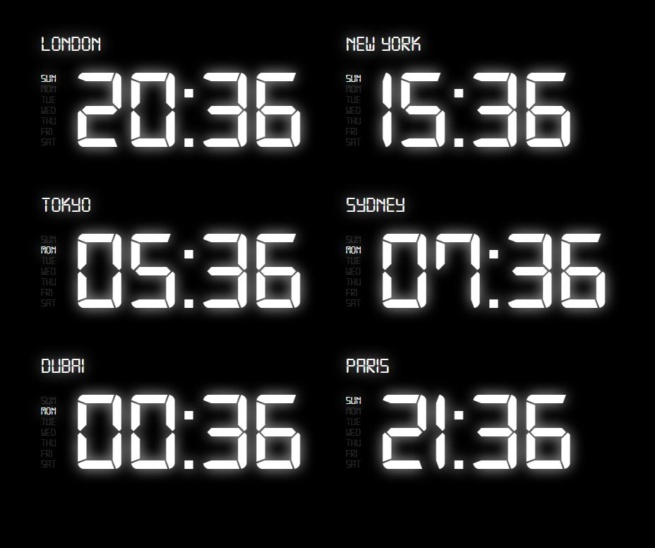

# Multizone Digital Clock - a React component

A React component for displaying a customizable digital clock with support for multiple time zones.

## Demo



## Features

- Display digital clocks for multiple time zones.
- Simple and intuitive to use.

## Installation

Clone the repo and install the packages

```bash
npm install
```

## Usage

Here's how you can use the `DigitalClock` component in your React application:

### Example

```jsx
function App() {
  return (
    <div>
      <DigitalClock title="London" timeZone="Europe/London" />
      <DigitalClock title="New York" timeZone="America/New_York" />
    </div>
  );
}
```

## Props

The `DigitalClock` component accepts the following props:

| Prop       | Type     | Default  | Description                           |
| ---------- | -------- | -------- | ------------------------------------- |
| `title`    | `string` |          | The title to display above the clock. |
| `timeZone` | `string` | Required | The IANA time zone string.            |
